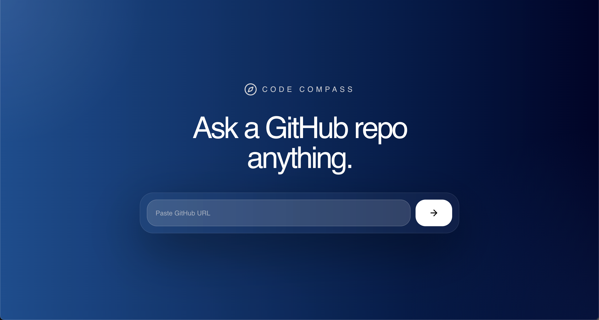
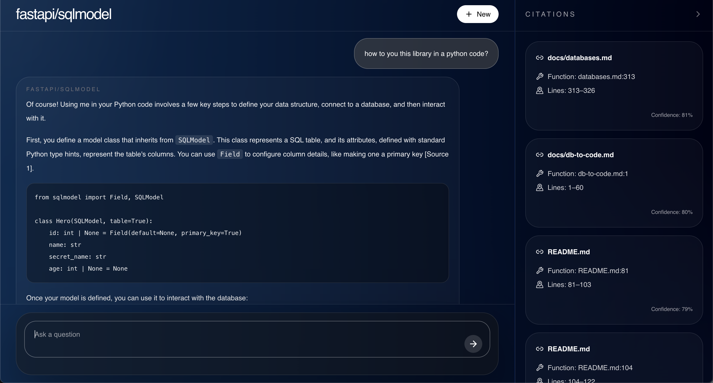

# Code Compass

An end-to-end repository question answering system that indexes a public GitHub codebase, retrieves grounded code evidence, and generates cited answers through a retrieval-augmented generation pipeline.

This project includes:
- a React frontend for repository submission and conversational querying
- a FastAPI backend for indexing and answering questions
- a hybrid retrieval pipeline with semantic search, BM25, and reranking
- an evaluation harness for measuring retrieval quality and answer grounding

## Why This Project Matters

Strong applied AI projects usually show:
- clear system design
- practical backend and frontend integration
- retrieval and ranking logic beyond a single prompt
- measurable evaluation instead of anecdotal demos
- thoughtful tradeoffs around cost, latency, and persistence

Code Compass brings those elements together in one end-to-end application.

## What The System Does

1. A user pastes a GitHub repository URL into the UI.
2. The backend clones the repository into a temporary local directory.
3. Source files are filtered and chunked using tree-sitter and fallback text chunking.
4. The system generates embeddings for chunks and stores them in a Qdrant-backed vector layer.
5. At query time, the system retrieves evidence with:
   - semantic vector search
   - lexical BM25 search
   - reciprocal rank fusion
   - cross-encoder reranking
6. The top grounded chunks are passed to the LLM to generate a concise answer.
7. The UI displays the answer with file-level citations and GitHub source links.

## App Screens







## Architecture

```text
┌──────────────────────┐
│      React UI        │
│  repo submit + chat  │
│  citations + status  │
└──────────┬───────────┘
           │ HTTP / JSON
           ▼
┌──────────────────────┐
│    FastAPI Server    │
│   routes + session   │
│      validation      │
└──────────┬───────────┘
           │
           ▼
┌──────────────────────────────────────────────┐
│              CodebaseRAGSystem               │
│ indexing orchestration + query orchestration │
└───────┬───────────────┬───────────────┬──────┘
        │               │               │
        │               │               │
        ▼               ▼               ▼
┌──────────────┐  ┌──────────────┐  ┌──────────────┐
│ RepoFetcher  │  │ CodeParser   │  │ Embeddings   │
│ clone/filter │  │ tree-sitter  │  │ Vertex/local │
└──────┬───────┘  │ fallback     │  └──────┬───────┘
       │          └──────┬───────┘         │
       │                 │                 │
       └────────────┬────┴────────────┬────┘
                    ▼                 ▼
           ┌──────────────┐   ┌──────────────┐
           │ SQLite       │   │ Qdrant       │
           │ repo/status  │   │ vector store │
           │ metadata     │   └──────┬───────┘
           └──────────────┘          │
                                     ▼
                           ┌──────────────────┐
                           │ Hybrid Retrieval │
                           │ semantic + BM25  │
                           │ + reranking      │
                           └────────┬─────────┘
                                    ▼
                           ┌──────────────────┐
                           │   LLM Answerer   │
                           │ grounded answer  │
                           │ + citations      │
                           └──────────────────┘
```

### Frontend

- React 19
- Tailwind CSS
- Axios for API communication

Responsibilities:
- collect the GitHub repository URL
- poll indexing state
- send chat questions and prior conversation turns
- render markdown-like answers
- display cited files, symbols, and line ranges

Main entry points:
- [`ui/src/App.js`](/Users/sivasankernp/Desktop/document-qa-rag-system/ui/src/App.js)
- [`ui/src/config.js`](/Users/sivasankernp/Desktop/document-qa-rag-system/ui/src/config.js)

### Backend

- FastAPI
- Pydantic
- SQLAlchemy
- SQLite for lightweight repository metadata

Responsibilities:
- validate requests
- manage session-scoped repository state
- run indexing in the background
- execute retrieval and answer generation
- return grounded answers and source metadata

Main entry points:
- [`server/server_app.py`](/Users/sivasankernp/Desktop/document-qa-rag-system/server/server_app.py)
- [`server/src/rag_system.py`](/Users/sivasankernp/Desktop/document-qa-rag-system/server/src/rag_system.py)

### Retrieval Pipeline

- tree-sitter for code-aware chunking
- Vertex AI or local embeddings for semantic retrieval depending on environment
- BM25 for lexical retrieval
- reciprocal rank fusion to combine retrieval channels
- a cross-encoder reranker for final source ordering
- Gemini or Groq-backed LLM generation depending on environment configuration

Core modules:
- [`server/src/code_parser.py`](/Users/sivasankernp/Desktop/document-qa-rag-system/server/src/code_parser.py)
- [`server/src/embeddings.py`](/Users/sivasankernp/Desktop/document-qa-rag-system/server/src/embeddings.py)
- [`server/src/hybrid_search.py`](/Users/sivasankernp/Desktop/document-qa-rag-system/server/src/hybrid_search.py)
- [`server/src/vector_store.py`](/Users/sivasankernp/Desktop/document-qa-rag-system/server/src/vector_store.py)
- [`server/src/repo_fetcher.py`](/Users/sivasankernp/Desktop/document-qa-rag-system/server/src/repo_fetcher.py)

## Data Flow

### Indexing Flow

1. `POST /api/repos/index`
2. Backend registers the repo against a session
3. Background task clones the repo
4. Files are filtered by extension, directory, and size
5. Files are chunked into code-aware segments
6. Embeddings are generated for each chunk
7. Chunks are stored in the vector layer and in in-memory retrieval state
8. Metadata and progress are exposed back to the UI

### Query Flow

1. `POST /api/query`
2. The backend validates the session and repository status
3. The question is expanded using lightweight intent heuristics
4. Semantic search retrieves candidate chunks
5. BM25 retrieves lexical matches
6. Results are fused and reranked
7. Final sources are selected and passed to the LLM
8. The backend returns:
   - `answer`
   - `confidence`
   - `sources`
   - repository metadata

## Tech Stack Decisions

### Why FastAPI

- fast iteration speed
- strong request validation through Pydantic
- simple background task support
- clean fit for JSON APIs and model-driven backend code

### Why React

- straightforward stateful UI for a single-page workflow
- easy integration with polling, chat state, and citation rendering
- strong ecosystem for incremental iteration

### Why tree-sitter

- better chunk boundaries than naive fixed-length splitting
- lets the system reason around functions, classes, and symbols
- improves retrieval quality for implementation-focused questions

### Why Hybrid Retrieval

Pure semantic search misses exact symbols and file names. Pure lexical search misses semantic intent. This project combines both because code questions often need:
- exact identifiers
- nearby implementation detail
- cross-file semantic similarity

### Why Qdrant

- simple vector abstraction
- local in-memory mode for fast demos
- cloud-compatible path for later deployment

### Why SQLite

- enough for lightweight repository/session metadata
- very low operational overhead
- matches the project goal of staying simple while preserving useful state

## Runtime Environments

### Local Development And Evaluation

Local development and the evaluation harness are designed around Vertex AI:
- Vertex AI Gemini for answer generation
- Vertex AI embeddings for semantic retrieval

This setup is useful for:
- higher quality local experiments
- benchmark runs with RAGAS
- comparing retrieval and answer quality in a stronger managed-model environment

### Production Deployment

The production deployment target is:
- frontend on Vercel
- backend on Hugging Face Spaces

Production inference is configured differently from local/eval:
- Groq-hosted Llama for answer generation
- lightweight local sentence-transformer embeddings for semantic retrieval

This production setup was chosen to fit Hugging Face Spaces free-tier constraints more comfortably while keeping the retrieval and answer pipeline intact.

Recommended production runtime:
- `LLM_PROVIDER=groq`
- `EMBEDDING_PROVIDER=local`
- `LIGHTWEIGHT_LOCAL_EMBEDDING_MODEL=sentence-transformers/all-MiniLM-L6-v2`

## Deployment

### Production Topology

- Vercel hosts the React frontend
- Hugging Face Spaces hosts the FastAPI backend
- the backend is packaged and deployed as a Docker Space
- GitHub Actions syncs the backend code to the Space on pushes to `main`

### Docker

The backend is deployed with Docker using:
- [`server/Dockerfile`](/Users/sivasankernp/Desktop/document-qa-rag-system/server/Dockerfile)

The container:
- installs Python dependencies
- copies the backend application
- starts the FastAPI app with Uvicorn on port `7860`

### CI/CD

Continuous deployment is handled through:
- [`.github/workflows/deploy-hf-space.yml`](/Users/sivasankernp/Desktop/document-qa-rag-system/.github/workflows/deploy-hf-space.yml)

The workflow:
- runs on pushes to `main`
- syncs the `server/` directory to the Hugging Face Space
- triggers the Docker Space rebuild automatically


## Evaluation And Benchmarking

The project includes an end-to-end eval harness that calls the live API instead of mocking the retrieval pipeline.

Files:
- [`server/evals/run_eval.py`](/Users/sivasankernp/Desktop/document-qa-rag-system/server/evals/run_eval.py)
- [`server/evals/sample_eval_set.json`](/Users/sivasankernp/Desktop/document-qa-rag-system/server/evals/sample_eval_set.json)

The benchmark currently measures:
- retrieval hit rate
- top-1 hit rate
- mean reciprocal rank
- source recall
- duplicate source rate
- keyword-based answer checks
- grounded answer rate
- optional RAGAS judge metrics such as faithfulness and answer relevancy

The project includes a measurable end-to-end evaluation workflow alongside the product itself.

### Benchmark Snapshot

Latest expanded internal benchmark:
- 37 evaluation cases
- 8 categories
- 4 multi-turn conversation cases

Headline metrics from the current benchmark run:

| Metric | Result |
| --- | ---: |
| Retrieval hit rate | 95.0% |
| Top-1 hit rate | 75.0% |
| Mean reciprocal rank | 0.85 |
| Source recall | 74.2% |
| Faithfulness (RAGAS) | 0.917 |
| Answer relevancy (RAGAS) | 0.843 |
| Context precision (RAGAS) | 0.767 |

What these numbers mean:
- the system retrieves at least one relevant source for the large majority of benchmark cases
- the first-ranked source is relevant in most cases, with the biggest remaining opportunity in canonical file ranking for harder prompts
- the benchmark includes architecture, API, setup, docs, tests, cross-file, and conversation-style questions
- the evaluation provides a solid engineering benchmark for the current system and repo scope

Benchmark strengths:
- strong retrieval on architecture and setup questions
- grounded answers with source-linked citations
- measurable end-to-end performance instead of anecdotal examples

Benchmark-exposed weaknesses:
- duplicate source retrieval still appears in some cases
- some cross-file and test-heavy questions remain harder than single-file API questions
- canonical implementation files are not always ranked first on the hardest prompts

## Project Strengths

- full-stack architecture with a clear data flow
- code-aware retrieval rather than plain document retrieval
- practical hybrid search design
- session-aware repo isolation
- source-grounded answer generation
- explicit benchmark and evaluation workflow

## Known Tradeoffs

- retrieval state is intentionally session-scoped and mostly in memory
- cloned repositories are temporary and deleted after indexing
- repository metadata is lightweight and persisted separately from vector state
- if the backend restarts, repositories must be re-indexed
- the benchmark is strong for the current project scope and can be expanded further across repositories over time

## Local Setup

### Backend

```bash
cd server
python -m venv .venv
source .venv/bin/activate
pip install -r requirements.txt
python server_app.py
```

Backend runs on `http://localhost:8000`

### Frontend

```bash
cd ui
npm install
npm start
```

Frontend runs on `http://localhost:3000`

Create `ui/.env`:

```bash
REACT_APP_API_URL=http://localhost:8000
```

## Running The Eval Harness

From the `server` directory:

```bash
CODEBASE_RAG_API_URL=http://localhost:8000 \
CODEBASE_RAG_SESSION_ID=<session-id> \
CODEBASE_RAG_REPO_ID=<repo-id> \
CODEBASE_RAG_EVAL_OUTPUT=evals/latest_eval_report.json \
python evals/run_eval.py
```

The output report includes:
- eval-set audit warnings
- headline metrics
- category breakdowns
- case-by-case detail
- a summary string suitable for project reporting

If you want to save the latest run as a JSON artifact:

```bash
CODEBASE_RAG_EVAL_OUTPUT=evals/latest_eval_report.json
```

## Repository Structure

```text
server/
  server_app.py
  evals/
  src/
ui/
  src/
README.md
```
