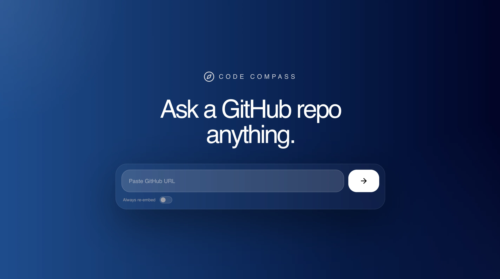
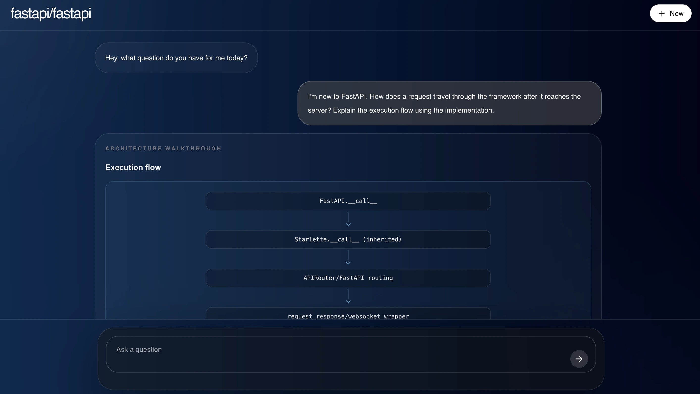
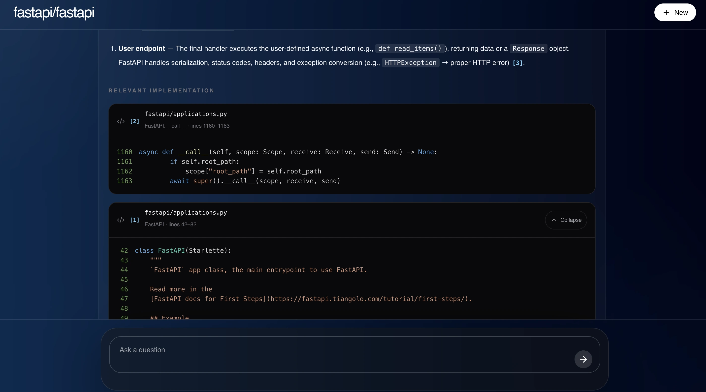
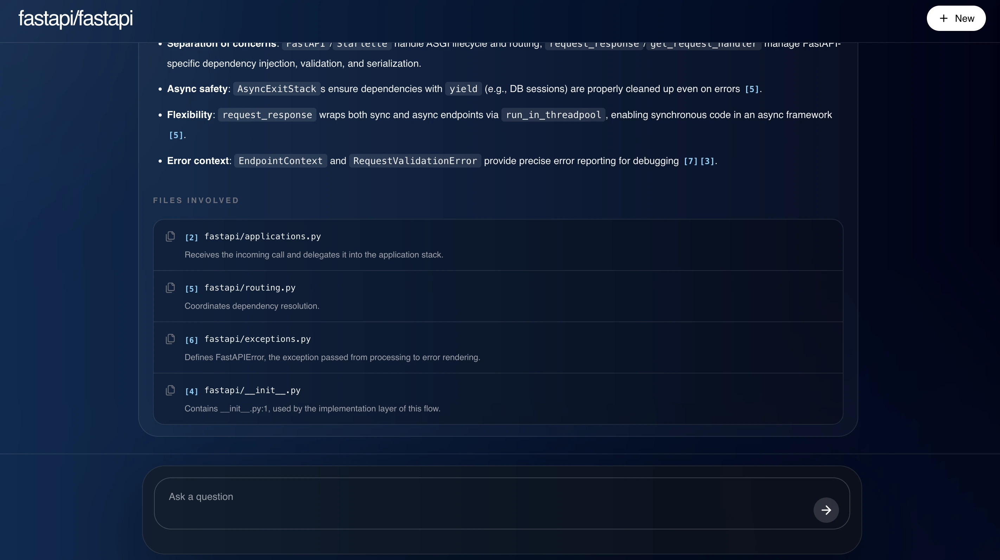
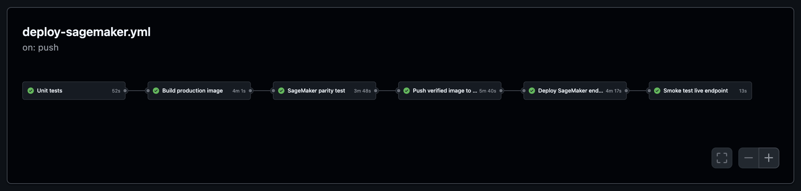
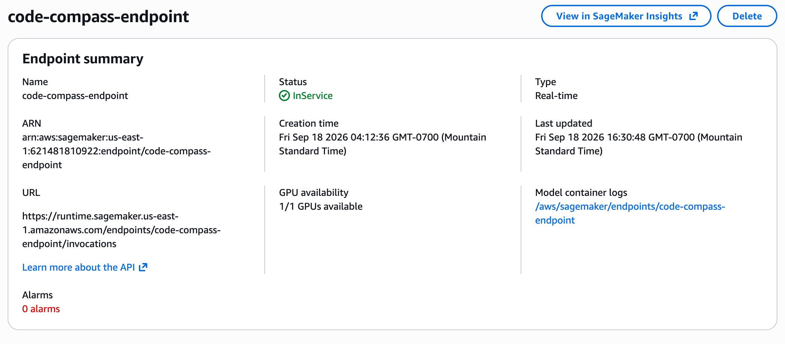
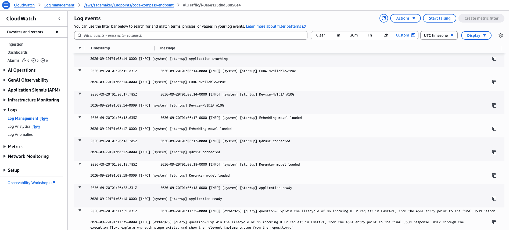
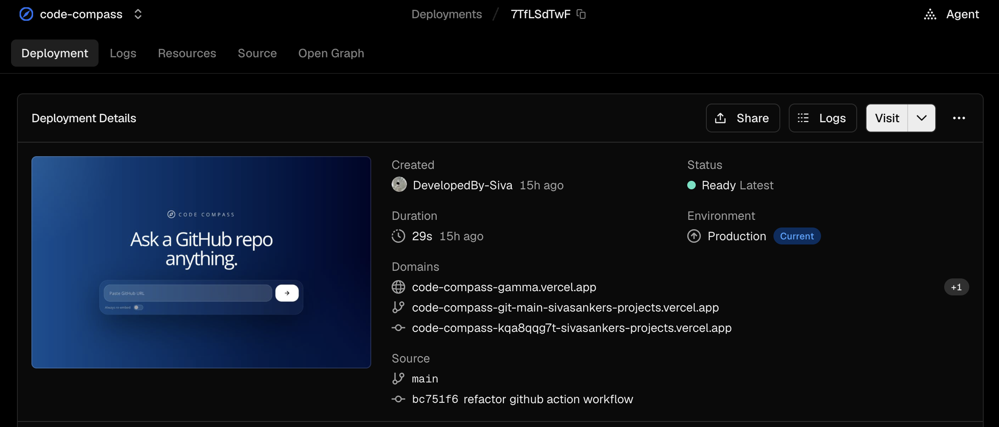

# Code Compass

**Ask questions about an unfamiliar GitHub repository and get answers grounded in its source code.**

Code Compass v1.0.0 is a full-stack codebase RAG system for exploring public GitHub repositories. It builds a code-aware index, retrieves and reranks the most relevant evidence, and produces concise answers with validated file and line-level citations.





<table>
  <tr>
    <td></td>
    <td></td>
  </tr>
</table>

## The problem

Understanding a large, unfamiliar repository means tracing symbols, configuration, tests, and cross-file request flows—not merely finding text that sounds related.

Embedding search alone misses exact identifiers and can over-rank duplicated documentation, translated files, tests, or semantically similar but non-canonical sources.

For an answer to be useful, retrieval must surface the actual implementation and generation must stay grounded in that evidence. Code Compass was built to make both stages observable and measurable.

## The solution

Code Compass combines **code-aware chunking**, **hybrid retrieval**, **model-based reranking**, and **grounded generation**. It returns answers with validated citations so a developer can move directly from an explanation to the supporting source.

## System Architecture

```text
Browser
   │
   ▼
Vercel (React + API proxy)
   │  OIDC
   ▼
SageMaker real-time endpoint
   ├── Qwen3 Embedding
   ├── Qwen3 Reranker
   ├── Qdrant Cloud
   └── Amazon Bedrock
```

The backend clones and parses a public repository, stores reusable embeddings in Qdrant, fuses semantic and lexical candidates, reranks the strongest evidence, and asks Qwen3-Coder-Next on Bedrock to answer only from the selected context.

## Engineering highlights

```text
GitHub Repository
    │
    ▼
Clone + Parse
    │
    ├──► Tree-sitter Chunks ──► Qwen3 Embedding ──► Qdrant Cloud
    │
    └──► BM25 Index

Developer Question
    │
    ▼
Intent Detection + Query Expansion
    │
    ▼
Hybrid Retrieval ◄── Qdrant Cloud + BM25
    │
    ▼
Qwen3 Reranker
    │
    ▼
Evidence Selection
    │
    ▼
Qwen3-Coder-Next on Amazon Bedrock
    │
    ▼
Grounded Answer + File and Line Citations
```

### Code-aware indexing

Tree-sitter chunks source around functions, classes, methods, and declarations. Module overviews preserve file-level context, while bounded fallback chunking handles documentation and unsupported languages.

### Hybrid retrieval

Semantic search, BM25, path and intent signals, and Reciprocal Rank Fusion cover both conceptual questions and exact identifiers. Diversity-aware selection prevents repeated or translated sources from crowding out implementation files.

### Repository caching

Qdrant stores persistent, branch-aware repository indexes. Re-indexing builds a hidden generation and activates it atomically, so a failed rebuild cannot replace the last working cache.

### GPU inference and CUDA compatibility

Qwen3-Embedding-0.6B and Qwen3-Reranker-0.6B run together on one GPU endpoint. Batched inference improves throughput while a single worker preserves the application’s process-local session and lexical state.

The container is based on the official PyTorch CUDA runtime to keep PyTorch, CUDA, and cuDNN aligned. Runtime startup can require CUDA explicitly and fails fast instead of silently falling back to CPU.

### CI/CD and local SageMaker parity

```text
Unit Tests
    │
    ▼
Build + Parity Test
    │
    └── Pull requests stop after validation
    │
    ▼ main push / manual dispatch
Push ECR (GitHub OIDC)
    │
    ▼
Deploy SageMaker (wait for InService)
    │
    ▼
Smoke Test (live invocation + failure diagnostics)
```

Every pull request runs unit tests and a local SageMaker compatibility test. Deployments to `main` publish the verified image to Amazon ECR, update the SageMaker endpoint using GitHub OIDC, and finish with an automated smoke test.

The same-origin Vercel function exchanges its workload identity for a narrowly scoped AWS role and invokes SageMaker without exposing AWS credentials to the browser. No long-lived AWS access keys are used by either deployment path.

### Structured logging

Every request receives a correlation ID. Runtime logs use only `[startup]`, `[index]`, `[query]`, and `[error]` categories. Routine dependency HTTP traffic and Uvicorn access records are suppressed, while warnings and errors remain visible. Index logs report repository, file/chunk counts, embedding time, and total time; query logs report the question, any rewrite, retrieved-document count, and latency.

## Engineering Challenges

| Challenge                                          | Investigation                                                                                                                                                                                                 | Final Solution                                                                                                                                                                                            |
| -------------------------------------------------- | ------------------------------------------------------------------------------------------------------------------------------------------------------------------------------------------------------------- | --------------------------------------------------------------------------------------------------------------------------------------------------------------------------------------------------------- |
| **Repository search answered _where_, not _how_**  | Early answers returned correct implementation details but failed to explain how components interacted. Architecture questions often focused on isolated exception paths instead of the normal execution flow. | Added an **architecture answer mode** that presents execution flow, implementation snippets, design rationale, and related files separately from implementation-focused answers.                          |
| **Explanations and displayed code drifted apart**  | The LLM explained one implementation while the UI independently selected different code snippets, making answers feel disconnected.                                                                           | Unified evidence selection so explanations and displayed snippets originate from the same repository evidence, improving consistency and grounding.                                                       |
| **Cross-file workflows were difficult to explain** | Lifecycle questions span multiple files, but the retrieval pipeline favored individual implementation details and could over-emphasize exception paths.                                                       | Improved intent classification and evidence selection so architecture questions follow the normal execution path across multiple files while implementation questions remain focused on specific symbols. |

## Evaluation Repositories

Code Compass was evaluated against **three real-world, unfamiliar open-source repositories** rather than synthetic examples.

| Repository    | Why it was chosen                                                                                                               | Characteristics                                                               |
| ------------- | ------------------------------------------------------------------------------------------------------------------------------- | ----------------------------------------------------------------------------- |
| **FastAPI**   | Modern Python web framework with heavy use of dependency injection, routing, validation, and response serialization.            | Medium-sized Python framework, cross-file request lifecycle, API internals.   |
| **Django**    | Large, mature framework with complex request handling, middleware, ORM, authentication, and templating.                         | Large Python codebase with deep inheritance and cross-module interactions.    |
| **Documenso** | TypeScript monorepo implementing document signing, authentication, storage, background jobs, and frontend/backend coordination. | Large full-stack monorepo with business workflows spanning multiple services. |

These repositories represent different repository structures, programming languages, and architectural styles, allowing the retrieval pipeline to be evaluated beyond a single framework or coding style.

## Evaluation

- **24 hand-written repository-understanding questions**
- **8 questions per repository**
- Questions focused on:
  - execution flow
  - implementation lookup
  - architecture
  - configuration
  - authentication
  - request lifecycle
  - error handling
  - cross-file reasoning

Evaluation measures:

- Final-context retrieval hit rate
- Top-1 retrieval accuracy
- Mean Reciprocal Rank (MRR)
- Candidate retrieval hit rate
- Grounded-answer rate
- Optional model-judged faithfulness

### Results

| Evaluation set                 | Questions | Retrieval hit rate | Top-1 accuracy |   MRR | Faithfulness |
| ------------------------------ | --------: | -----------------: | -------------: | ----: | -----------: |
| FastAPI, Django, and Documenso |        24 |             91.67% |         70.83% | 0.813 |       99.17% |

## Deployment overview

```text
GitHub ──► GitHub Actions ──► Amazon ECR ──► SageMaker
                                                 ├── Bedrock
                                                 └── Qdrant Cloud

React  ──► Vercel ── OIDC / InvokeEndpoint ──────┘
```

The deployment uses immutable SageMaker model/config versions, a stable endpoint, non-root containers, health-gated startup, and short-lived OIDC credentials for both CI/CD and runtime invocation. See the [AWS deployment guide](docs/deployment.md) for the serving contract, IAM scope, scripts, configuration, and deployment tradeoffs.

| GitHub Actions                                           | Amazon SageMaker                                      |
| -------------------------------------------------------- | ----------------------------------------------------- |
|  |  |

| Amazon CloudWatch                                    | Vercel                                             |
| ---------------------------------------------------- | -------------------------------------------------- |
|  |  |

## Tech stack

| Layer          | Technology                                         |
| -------------- | -------------------------------------------------- |
| Frontend       | React 19, Tailwind CSS, Axios, Vercel              |
| API            | FastAPI, Pydantic, Uvicorn                         |
| Parsing        | tree-sitter, symbol-aware and fallback chunking    |
| Retrieval      | Qwen3-Embedding-0.6B, BM25, RRF, Qdrant Cloud      |
| Reranking      | Qwen3-Reranker-0.6B, PyTorch, Transformers         |
| Generation     | Qwen3-Coder-Next on Amazon Bedrock                 |
| Infrastructure | Docker, Amazon ECR, SageMaker, GitHub Actions OIDC |

## Local development

Prerequisites: Python 3.11+, Node.js 18+, a Qdrant instance, and AWS credentials with access to the configured Bedrock model. CUDA is strongly recommended for embedding and reranking.

### Backend

```bash
python3 -m venv .venv
source .venv/bin/activate
pip install -r server/requirements.txt

cd server
export AWS_REGION=us-east-1
export QDRANT_URL=https://your-cluster.us-east.aws.cloud.qdrant.io:6333
export QDRANT_API_KEY=your-qdrant-api-key
export PORT=8000
python server_app.py
```

### Frontend

```bash
cd ui
npm ci
cp .env.example .env
npm start
```

Open `http://localhost:3000`, submit a public GitHub URL, wait for indexing, and start asking questions. For evaluation commands, API examples, runtime configuration, and AWS deployment, see [docs/deployment.md](docs/deployment.md).

## Known Limitations

- Supports public GitHub repositories only.
- Session metadata and BM25 indexes are process-local, so the reference deployment runs as a single SageMaker instance with one worker.
- Repository indexing is performed on demand; very large repositories take longer to analyze before questions can be answered.

## What I learned

- Measuring retrieval is more valuable than guessing.
- ML systems fail at deployment boundaries, not only because of model quality.
- Repository understanding requires architectural reasoning, not just semantic search.
