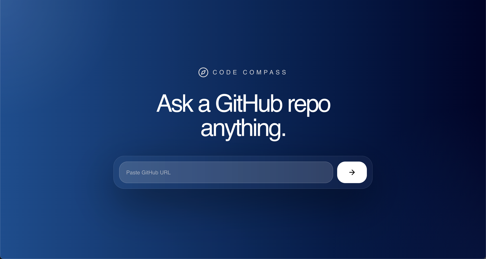
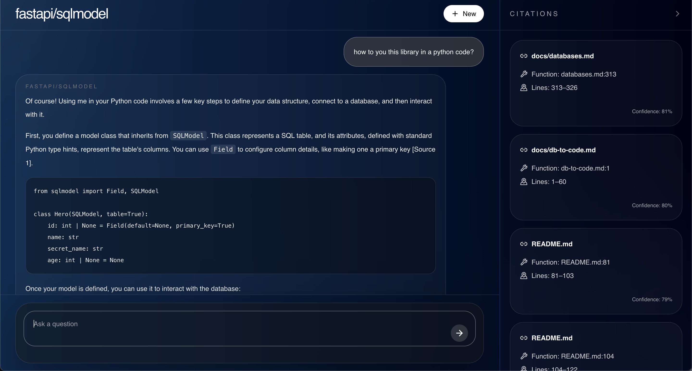

# Code Compass

### Ask questions about an unfamiliar GitHub repository and get answers grounded in its source code.

Code Compass is a full-stack codebase RAG system. Give it a public GitHub URL, let it build a code-aware index, and ask questions such as:

> Where is authentication implemented?

> How does an incoming request become a response?

> Which files participate in the document-signing flow?

Instead of answering from model memory, Code Compass retrieves evidence from the repository, reranks it, and returns a concise answer with file and line-level citations.

The project is designed around the parts of code RAG that are easy to underestimate: symbol-aware chunking, exact identifier search, cross-file questions, canonical-source ranking, noisy tests and translated documentation, conversational follow-ups, and measurable retrieval quality.

## Results

The evaluation suite contains 24 hand-written questions across three real, unfamiliar repositories:

- [Documenso](https://github.com/documenso/documenso) — large TypeScript monorepo
- [FastAPI](https://github.com/fastapi/fastapi) — Python API framework
- [Django](https://github.com/django/django) — large Python web framework

### Retrieval improvement

| Metric | Baseline | Optimized | Change |
|---|---:|---:|---:|
| Final-context retrieval hit rate | 58.33% (14/24) | **91.67% (22/24)** | **+33.34 pp** |
| Top-1 hit rate | 33.33% (8/24) | **79.17% (19/24)** | **+45.84 pp** |
| Mean Reciprocal Rank | 0.441 | **0.854** | **+93.7%** |
| Candidate retrieval hit rate | — | **100% (24/24)** | — |
| Expected-source grounded rate | 58.33% | **91.67%** | **+33.34 pp** |

### Results by repository

| Repository | Retrieval | Top-1 | MRR |
|---|---:|---:|---:|
| Documenso | **100%** | **87.5%** | **0.938** |
| FastAPI | **87.5%** | **75.0%** | **0.813** |
| Django | **87.5%** | **75.0%** | **0.813** |

The optimized totals are aggregated from three repository-specific runs using the same retrieval implementation and eight cases per repository. Faithfulness judging was disabled in these optimization runs to isolate retrieval quality; the earlier full baseline measured answer faithfulness at 89.17%. The benchmark is intentionally small and should be read as a regression suite, not a universal code-retrieval benchmark.

Two remaining misses are known and diagnosable: FastAPI OpenAPI generation and Django's request-to-response lifecycle. In both cases the relevant source enters the candidate set but loses during channel fusion or final ranking. This is useful evidence that the next improvement belongs in retrieval orchestration—not in fine-tuning the answer model.

## Product walkthrough

### Repository selection and indexing



### Grounded answers with source citations



## How it works

```text
Public GitHub repository
          │
          ▼
 Clone, filter, and parse files
          │
          ▼
 tree-sitter symbol chunks + module overviews
          │
          ├───────────────┐
          ▼               ▼
 Qwen3 embeddings       BM25
          │               │
          └──────┬────────┘
                 ▼
       Reciprocal Rank Fusion
                 │
        Path and intent signals
                 │
                 ▼
       Qwen3-Reranker-4B
                 │
       Diversity-aware selection
                 │
                 ▼
 Qwen3-Coder-Next on Amazon Bedrock
                 │
                 ▼
 Answer + validated source citations
```

### 1. Code-aware indexing

The backend shallow-clones a public repository, ignores generated and dependency directories, and keeps supported source, configuration, markup, and documentation files.

Tree-sitter creates chunks around functions, classes, methods, declarations, and containers. Large classes receive compact overview chunks while their methods remain independently searchable. Each parsed source file also receives a module overview containing its path, role, imports, exports, and symbols. Plain-text and unsupported-language files use bounded fallback chunking.

Repository clones are deleted after indexing; only chunks, metadata, and embeddings remain.

### 2. Hybrid candidate retrieval

Every question uses multiple complementary signals:

- **Semantic retrieval** with Qwen3-Embedding-4B for conceptual similarity
- **BM25 retrieval** for filenames, symbols, framework terminology, and exact identifiers
- **Path and intent retrieval** for likely implementation locations
- **Reciprocal Rank Fusion** to combine independently ranked channels

The system over-fetches before deduplication so repeated chunks and translated copies of the same documentation cannot consume the entire candidate budget.

### 3. Model-based reranking

Qwen3-Reranker-4B scores query–chunk pairs using the model's native `yes`/`no` relevance format. Candidates are processed in configurable GPU batches and then combined with lexical, semantic, path, and canonical-source signals.

The final selector limits repeated chunks from the same file and adds source diversity for cross-file questions.

### 4. Grounded answer generation

The selected evidence is sent to Qwen3-Coder-Next through Amazon Bedrock. The prompt requires the model to:

- use only retrieved repository context;
- name concrete files and symbols;
- distinguish evidence from inference;
- add inline citations such as `[1]` and `[2]`;
- acknowledge when the available evidence is insufficient.

Returned citation numbers are validated against the supplied sources before the API response is sent to the client.

## What improved retrieval quality

The initial system retrieved a relevant final source in only 14 of 24 cases. Retrieval diagnostics exposed the failure stage for every question and led to several targeted fixes:

- Replaced incorrect mean pooling with Qwen3's required last-token embedding pooling.
- Added task instructions to query embeddings while leaving document embeddings unprefixed.
- Corrected the Qwen3 reranker prompt and relevance-token scoring. The broken version assigned the same score to every candidate.
- Batched reranking for GPU throughput.
- Increased candidate recall through controlled over-fetching.
- Prevented localized documentation and repeated file chunks from flooding retrieval.
- Reduced the influence of noisy path-only matches.
- Improved cross-file question classification.
- Penalized test sources for non-test questions.
- Removed an early top-eight truncation that discarded relevant sources before final selection.
- Fixed Unicode byte-offset handling in tree-sitter symbol extraction.
- Added per-stage metrics so candidate generation, fusion, reranking, and final-context failures are measured separately.

This moved the system from **58.33% to 91.67% final-context retrieval** without fine-tuning a model.

## Evaluation

The evaluation set covers repository purpose, implementation lookup, API behavior, configuration, tests, error handling, security, cross-file flows, and conversational follow-ups.

Reported metrics include:

- candidate retrieval hit rate;
- semantic, lexical, fused, and path hit rates;
- reranker and prioritized Top-K hit rates;
- final-context retrieval hit rate;
- Top-1 hit rate and Mean Reciprocal Rank;
- expected-source grounded-answer rate;
- optional LLM-judged faithfulness;

Run the complete evaluation from the repository root:

```bash
CODEBASE_RAG_REINDEX=1 \
CODEBASE_RAG_EVAL_OUTPUT=server/evals/results/full_eval.json \
python server/evals/run_eval.py
```

Run a single repository while iterating:

```bash
CODEBASE_RAG_EVAL_REPOS=fastapi \
CODEBASE_RAG_REINDEX=1 \
CODEBASE_RAG_ENABLE_FAITHFULNESS=0 \
CODEBASE_RAG_EVAL_OUTPUT=server/evals/results/fastapi.json \
python server/evals/run_eval.py
```

Valid repository IDs are `documenso`, `fastapi`, and `django`.

The cases are defined in [`server/evals/sample_eval_set.json`](server/evals/sample_eval_set.json). Retrieval regression tests live in [`server/tests/test_retrieval_quality.py`](server/tests/test_retrieval_quality.py).

## Technology stack

| Layer | Technologies |
|---|---|
| Frontend | React 19, Tailwind CSS, Axios |
| API | FastAPI, Pydantic, Uvicorn |
| Parsing | tree-sitter, language-specific syntax trees, fallback text chunking |
| Retrieval | Qwen3-Embedding-4B, Chroma, BM25, Reciprocal Rank Fusion |
| Reranking | Qwen3-Reranker-4B, PyTorch, Hugging Face Transformers |
| Generation | Qwen3-Coder-Next through Amazon Bedrock |
| Infrastructure | Docker-ready backend, Vercel-ready frontend |

## Run locally

### Prerequisites

- Python 3.11+
- Node.js 18+
- AWS credentials with access to Qwen3-Coder-Next in Amazon Bedrock
- A CUDA GPU is strongly recommended for the local embedding and reranking models

### Backend

```bash
python3 -m venv .venv
source .venv/bin/activate
pip install -r server/requirements.txt

cd server
export AWS_REGION=us-east-1
export CHROMA_PATH=./data/chroma
python server_app.py
```

The API starts at `http://localhost:8000`.

### Frontend

In another terminal:

```bash
cd ui
npm install

cat > .env <<'ENV'
REACT_APP_API_URL=http://localhost:8000
ENV

npm start
```

The UI starts at `http://localhost:3000`.

## API

All repository operations are scoped by an `X-Session-Id` header.

| Method | Endpoint | Purpose |
|---|---|---|
| `POST` | `/api/repos/index` | Clone and asynchronously index a repository |
| `GET` | `/api/repos` | List repositories for the current session |
| `GET` | `/api/repos/{repo_id}` | Read indexing status and metadata |
| `POST` | `/api/query` | Ask a grounded question about an indexed repository |
| `POST` | `/api/session/end` | Delete session-scoped repository data |

Example query:

```bash
curl -X POST http://localhost:8000/api/query \
  -H 'Content-Type: application/json' \
  -H 'X-Session-Id: portfolio-demo-session' \
  -d '{
    "repo_id": 1,
    "question": "Where is request validation handled?",
    "top_k": 8,
    "history": []
  }'
```

## Configuration

| Variable | Default | Purpose |
|---|---|---|
| `AWS_REGION` | `us-east-1` fallback | Amazon Bedrock region |
| `CHROMA_PATH` | `./data/chroma` | Persistent vector-store directory |
| `CHROMA_COLLECTION` | versioned default | Chroma collection override |
| `CHROMA_UPSERT_BATCH_SIZE` | `64` | Chroma indexing batch size |
| `CORS_ORIGINS` | `http://localhost:3000` | Comma-separated allowed origins |
| `SESSION_TTL_MINUTES` | `120` | Session lifetime |
| `QWEN_EMBEDDING_BATCH_SIZE` | `8` | Embedding batch size |
| `RAG_RERANK_BATCH_SIZE` | `4` | Reranker batch size |
| `RAG_FINAL_SOURCE_LIMIT` | request `top_k` | Maximum evidence sources sent to the answer model |
| `RAG_SEARCH_MULTIPLIER` | `4` | Candidate depth for shallow questions |
| `RAG_DEEP_SEARCH_MULTIPLIER` | `8` | Candidate depth for implementation-heavy questions |

## Project structure

```text
code-compass/
├── server/
│   ├── server_app.py             # FastAPI routes and request models
│   ├── evals/
│   │   ├── run_eval.py           # Evaluation runner and stage metrics
│   │   └── sample_eval_set.json  # 24-case benchmark
│   ├── src/
│   │   ├── code_parser.py        # tree-sitter and fallback chunking
│   │   ├── embeddings.py         # Qwen3 embeddings
│   │   ├── hybrid_search.py      # BM25, RRF, and reranking
│   │   ├── rag_system.py         # Indexing, retrieval, and generation orchestration
│   │   ├── repo_fetcher.py       # GitHub cloning and file filtering
│   │   └── vector_store.py       # Chroma persistence and search
│   └── tests/
│       └── test_retrieval_quality.py
├── ui/
│   └── src/                      # React application
└── images/                       # Portfolio screenshots
```

## Current limitations

- Only public GitHub repositories are supported.
- Repository metadata and active session state are held in memory.
- Large repositories take time to parse and embed.
- Running two local 4B models requires meaningful RAM or GPU memory.
- Model-based reranking improves quality but remains the largest retrieval-time cost.
- The system does not yet build a call graph or dependency graph.
- The benchmark is a focused regression suite; broader repository and language coverage is still needed.
- Two of the 24 current cases still retrieve relevant candidates but fail final ranking.

## Why this project matters

Code Compass is more than a chat interface over embeddings. It demonstrates an end-to-end retrieval system with observable failure stages, reproducible evaluation, GPU-aware inference, grounded generation, session-scoped API design, and iterative quality improvements driven by evidence rather than prompt changes alone.
